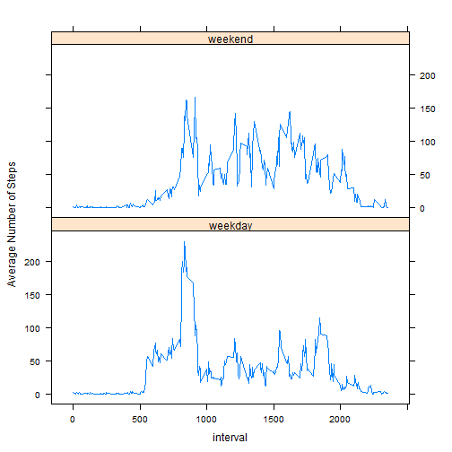

## Loading and preprocessing the data
The data was read in from csv file. The the date was converted into R date format.
The NAs were removed first for analysis.

```r
activity <- read.csv("~/activity.csv")
activity$date <- as.Date(activity$date)
activity_1 <- activity[!is.na(activity$steps),]
```


## What is mean total number of steps taken per day?
The total number of steps per day was plotted in histogram. The mean and median of the histogram were also computed.

```r
Steps_per_day <- tapply(activity_1$steps,activity_1$date,sum)
hist(Steps_per_day)
```


```r
Mean_per_day <- as.integer(mean(Steps_per_day))
Median_per_day <- as.integer(median(Steps_per_day))
```
The mean of total number of step taken per day is 10766.   
The median of total number of step taken per day is 10765.


## What is the average daily activity pattern?
A time series plot was made to show the average daily activity pattern of the 5-minute interval.

```r
Steps_per_Interval <- tapply(activity_1$steps,activity_1$interval,mean)
plot(as.numeric(names(Steps_per_Interval)), 
     Steps_per_Interval, type = "l", 
     xlab = "Interval", ylab = "Average Number of Steps", 
     main = "Average Daily Activity Pattern")
```


```r
Max_Step <- as.integer(max(Steps_per_Interval))
Max_Interval <- names(sort(Steps_per_Interval,decreasing = TRUE)[1])
```
The maximum number of steps is 206, which occured in 835 of 5-minute interval.


## Imputing missing values
The missing values were replaced by the average number of steps in the same 5-minute interval.

```r
Number_missing <- sum(is.na(activity$steps))
Steps_per_Interval <- tapply(activity_1$steps,activity_1$interval,mean)
activity_split <- split(activity,activity$interval)
for (i in 1:length(activity_split)) {
  activity_split[[i]]$steps[is.na(activity_split[[i]]$steps)] <- 
    round(Steps_per_Interval[i],0)
}
activity_new <- do.call("rbind",activity_split)
```
The total number of missing data is 2304.


```r
Steps_per_day_new <- tapply(activity_new$steps,activity_new$date,sum)
hist(Steps_per_day_new)
```


```r
Mean_per_day_new <- as.integer(mean(Steps_per_day_new))
Median_per_day_new <- as.integer(median(Steps_per_day_new))
```
The mean of total number of step taken per day for new dataset is 10765.   
The median of total number of step taken per day for new dataset is 10762.  
A slight difference was observed when the missing values were replaced by the average values.

## Are there differences in activity patterns between weekdays and weekends?
A function was created to determine if it is weekday or weekend. Then a new column which indicates the weekday or weekend was added to the data fram.

```r
ifweekday <- function (d) {
  ifelse(weekdays(d) == "Saturday" | weekdays(d) == "Sunday", "weekend", "weekday")
}
wd <- sapply(activity_new$date, ifweekday)
activity_new$days <- as.factor(wd)

activity_days <- aggregate(steps~days+interval, data = activity_new, FUN = mean)
library(lattice)
xyplot(steps~interval | factor(days), data = activity_days,
       layout = c(1,2), type = "l",
       xlab = "interval", ylab = "Average Number of Steps",
       lty = 1)
```


